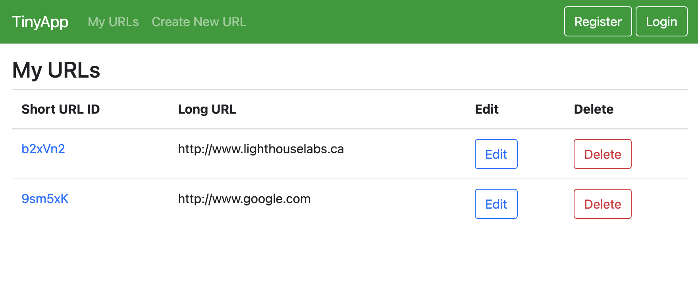
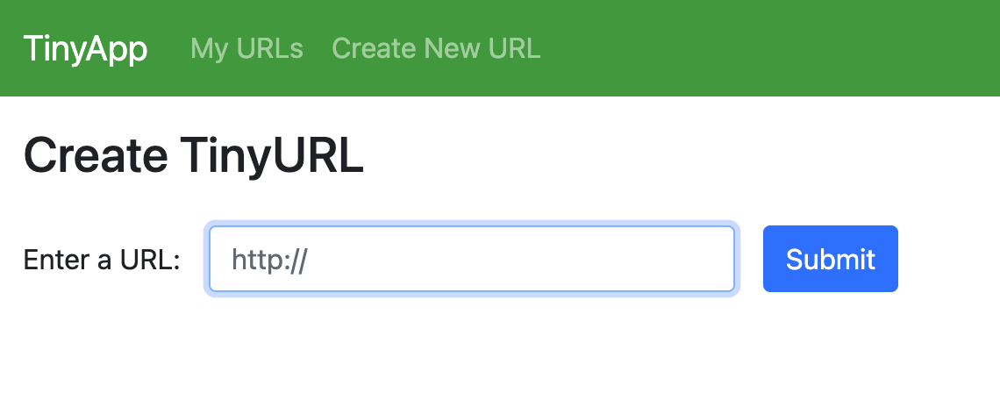
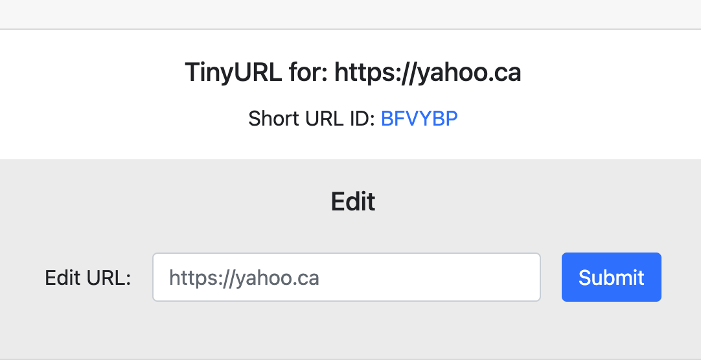

# TinyApp - A Lighthouse Project
This app is a URL Shortener is a service that takes a regular URL and transforms it into an encoded version, which redirects back to the original URL. For example:

https://www.lighthouselabs.ca → http://goo.gl/6alQXu

## Features
List of all the generated shorten URL and you can edit the URL anytime or delete the URL.

To create the URL simply just type the long URL into the input box and hit Submit button.

This is the result after the URL is shorten and you can edit the URL for correction.

## How to use
1. After cloning this repo.
2. Run `npm start` in the terminal.
3. Go to your browser and enter 'http://localhost:8080'